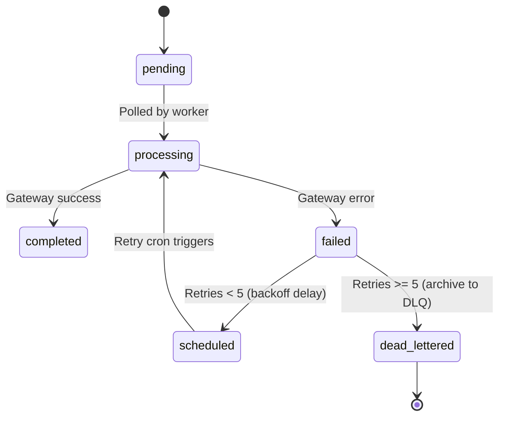

# Enterprise Email System Architecture

This document describes the technical architecture, tables, queues, retries, and tracking mechanics of the **RishtaJodo Matrimony Email System**.

---

## 1. Technical Components & Dependencies

```
src/features/notification/email/
├── interfaces/
│   └── email-provider.interface.ts # Interface contract
├── providers/
│   ├── msg91-email.provider.ts    # MSG91 gateway transport
│   └── mock-email.provider.ts     # Dev sandbox & testing
├── services/
│   ├── email-renderer.ts          # Brand/Theme HTML compiler
│   ├── tracking.service.ts        # Open & Click tracking wrapping
│   ├── attachment.service.ts      # Checks attachment sizes (max 5MB/10MB)
│   ├── email-queue.service.ts     # Locking worker polls pending jobs
│   ├── email-retry.service.ts     # Backoff scheduler and DLQ router
│   ├── email-analytics.service.ts # Aggregates daily analytics rollup
│   └── email-preview.service.ts   # Iframe mock variables renderer
└── utils/
    └── email.logger.ts            # Audit logs and RPC mark statuses
```

---

## 2. Queueing & Locking Engine

Email queueing utilizes the `email_queue` database table:
1.  **Priority Dispatch**: Email queue selects jobs sorted by `priority` (`'low'`, `'normal'`, `'high'`, `'critical'`) and `scheduled_for`.
2.  **Worker Locks**: When `EmailQueueService` polls, it updates jobs to `status = 'processing'` in a single batch, protecting against duplicate delivery in load-balanced environments.

---

## 3. Retries & Dead-Letter Queue (DLQ)



*   **DLQ Destination**: Exhausted jobs are archived in the `failed_notifications` table with status `'dead_lettered'`. This records the payload, final gateway error codes, and audit metrics.

---

## 4. Open & Click Tracking Mechanics

*   **Open Pixel**: A transparent `1x1 GIF` image tag is appended before `</body>`. The image source requests:
    `[Domain]/api/notification/email/tracking/open?id=[QueueID]`
    When requested, it updates `opened_at` in the database.
*   **Click Redirects**: Body anchor tags are wrapped with:
    `[Domain]/api/notification/email/tracking/click?id=[QueueID]&url=[EncodedTargetURL]`
    This records `clicked_at` and performs a `302` HTTP redirect to the destination.
*   **Webhook Listener**: Captures real-time webhook updates from MSG91 at `/api/notification/email/webhook` (opens, clicks, bounces, spam complaints) and maps them to database logs.
