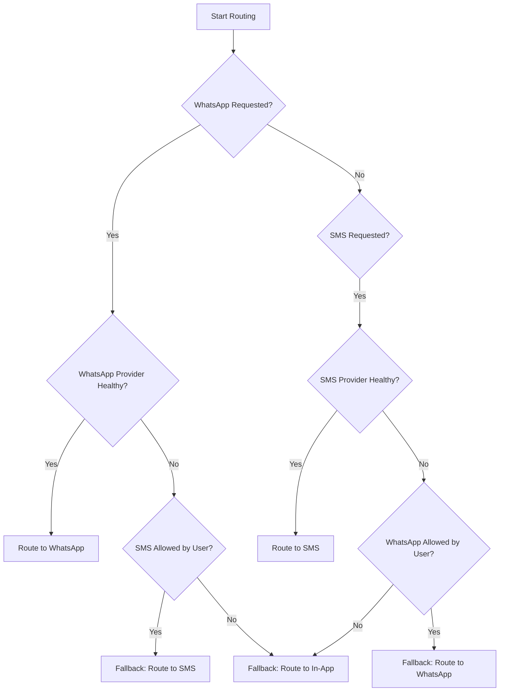

# Central Notification Engine Architecture

This document describes the technical architecture, design patterns, and routing flow of the **Enterprise Notification Engine** in **RishtaJodo Matrimony**.

---

## 1. Technical Components & Dependencies

```
src/features/notification/engine/
├── config/
│   └── engine.config.ts        # Channel overrides and rate-limits config
├── events/
│   └── event-bus.ts            # Observer Event Bus (Pub/Sub)
├── logs/
│   └── notification-logger.ts  # Database audit logs sink
├── middleware/
│   └── notification-middleware.ts # Throttling limits and duplication checks
├── orchestrator/
│   └── notification-orchestrator.ts # Coordinates pipeline context
├── pipeline/
│   └── notification-pipeline.ts # Sequential execution manager
├── resolver/
│   └── notification-resolver.ts # Resolves user email/phone permissions
├── routing/
│   └── notification-router.ts   # Failover router (WhatsApp <-> SMS)
├── scheduler/
│   └── notification-scheduler.ts# Scheduled queue database scheduler
├── services/
│   └── notification-engine.ts   # Unified engine facade interface
├── tracking/
│   └── notification-tracker.ts  # Queue, dispatch and read latency tracker
├── analytics/
│   └── notification-analytics.ts# Channel performance stats compiler
├── types/
│   └── engine.types.ts          # Pipeline types and context interface
└── utils/
    └── notification-factory.ts  # Factory dependency injector
```

---

## 2. Design Patterns Employed

*   **Facade Pattern (`NotificationEngine`)**: Simplifies interaction by exposing a single unified class interface for all channel communications.
*   **Observer Pattern (`EventBus`)**: Decouples event publishers (e.g. Payments, Matches) from the notification pipeline.
*   **Strategy Pattern (`NotificationService` Providers)**: Selects the appropriate channel adapter dynamically based on routed delivery choices.
*   **Chain of Responsibility (`NotificationPipeline`)**: Executes verification middleware stages sequentially, with early cancellation support on blocks.

---

## 3. High-Availability Fallback Routing



*   **WhatsApp $\rightarrow$ SMS Failover**: If the WhatsApp API health check fails or reports transit blocks, the system automatically redirects the message payload to the SMS channel (assuming the user has SMS enabled).
*   **SMS $\rightarrow$ WhatsApp Failover**: If SMS networks are congested or unavailable, notifications fallback to WhatsApp.
