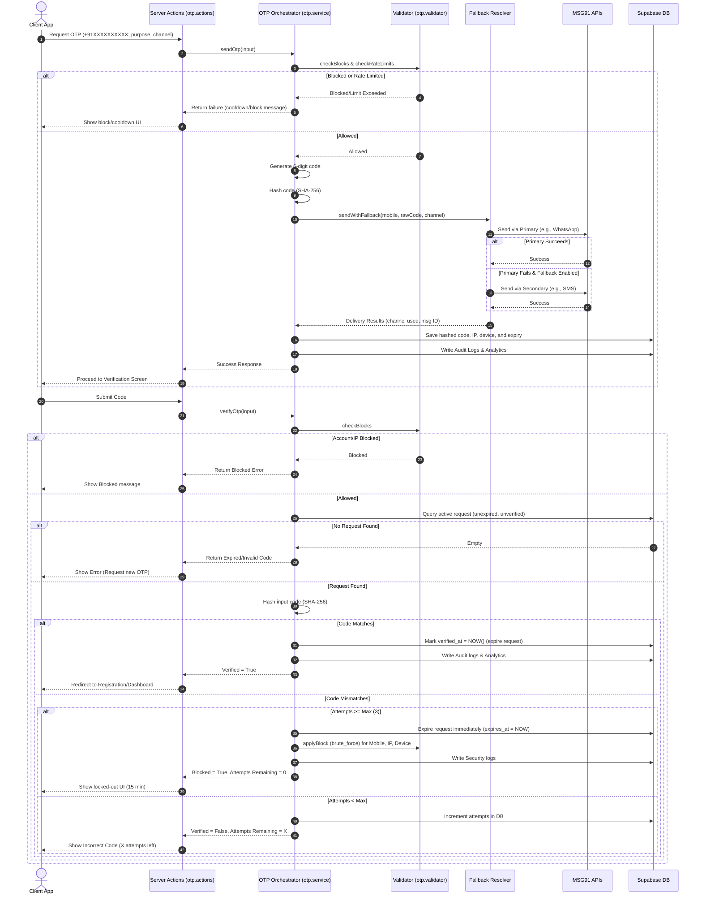

# Enterprise OTP Authentication Engine

This document details the architecture, flows, security mechanisms, fallback logic, rate limiting, and operational best practices for the Enterprise OTP Authentication Engine in **RishtaJodo Matrimony**.

---

## 1. Directory Structure

All components of the OTP Authentication module are isolated inside `src/features/notification/otp/` utilizing Feature-First and Clean Architecture principles:

```
src/features/notification/otp/
├── actions/
│   └── otp.actions.ts           # Server Actions exposing OTP capability to client components
├── config/
│   ├── otp.config.ts            # Core configurations (lengths, expiry, channels)
│   └── security.config.ts       # Security & threshold configurations (rate limits, locks)
├── interfaces/
│   └── otp-provider.interface.ts # Interface definitions for delivery providers
├── providers/
│   ├── msg91-sms.provider.ts    # MSG91 SMS SendOTP Provider
│   ├── msg91-whatsapp.provider.ts# MSG91 WhatsApp OTP Provider
│   └── mock-otp.provider.ts     # Developer-friendly Console/Test Provider
├── services/
│   ├── fallback-resolver.ts     # Implements automatic channel fallback
│   ├── otp.service.ts           # Main orchestrator (hashing, database persistence, logs)
│   └── otp-service.factory.ts   # Dependency Injection Factory
├── tests/
│   └── otp.test.ts              # Unit and integration test suite
├── types/
│   ├── otp.types.ts             # Application domain DTOs
│   └── otp-database.types.ts    # Database-level entities
├── utils/
│   ├── otp.analytics.ts         # Tracks deliverability metrics and telemetry
│   └── otp.logger.ts            # Detailed audit logger for security tracing
└── validators/
    └── otp.validator.ts         # Validates E.164 phone numbers, active blocks, and rate limits
```

---

## 2. Authentication Flow

The end-to-end registration flow with OTP authentication executes as follows:



---

## 3. Core Security Controls

The OTP engine implements the following robust security measures:

*   **Zero-Plaintext Storage**: Plaintext codes are never stored in the database or logs. The code is immediately hashed using SHA-256. Verification is done by hashing the input code and matching it against the stored hash in the database.
*   **One-Time Use (Instant Expiry)**: A request is marked as expired (`expires_at` is set to `now()`) immediately upon successful verification to prevent replay attacks.
*   **Active Request Invalidation**: Whenever a new OTP is requested (or resent) for a specific mobile and purpose, all previous active (unverified) requests for that target are instantly expired in the database.
*   **Brute-Force Lockouts**: If a user submits incorrect codes 3 times (`SECURITY_CONFIG.maxAttempts`), the OTP request is deleted/expired, and a `brute_force` block is placed on the mobile number, IP address, and device fingerprint for 15 minutes.
*   **Anti-Spam Rate Limiting**:
    *   **Cooldown**: Users must wait 30 seconds between consecutive OTP requests (`OTP_CONFIG.cooldownSeconds`).
    *   **Daily Request Cap**: A maximum of 10 OTP requests is allowed per mobile number in a rolling 24-hour window. Reaching this limit automatically blocks the mobile number for 24 hours (`daily_limit`).
    *   **Rapid Request Checks**: If an IP address or device fingerprint makes 5 or more OTP requests within a 60-second window, it is flagged as a spam engine, and the IP/device is blocked for 30 minutes (`rapid_requests`).

---

## 4. Automatic Channel Fallback

*   **Primary Channel**: Defaults to WhatsApp (`whatsapp`) to minimize delivery cost and maximize speed.
*   **Secondary Channel (SMS)**: If the WhatsApp API returns a non-successful response or fails to respond, the `FallbackResolver` automatically intercepts the error and dispatches the code via MSG91 SendOTP SMS.
*   **Graceful Degradation**: If both providers fail, the transaction fails gracefully, and is logged in the `notification_logs` and `notification_analytics` tables for monitoring.

---

## 5. Developer & Testing Environment

*   **Mock Injection**: In development and test environments where `MSG91_AUTH_KEY` is not present in `.env.local`, the Dependency Injection factory (`createOtpService`) automatically wires `MockOtpProvider`.
*   **Local Console Logs**: Instead of making real API requests, mock providers output the generated 6-digit codes to the node console/logs to allow developers to retrieve and complete sign-up flows easily without cost.

---

## 6. Monitoring and Operations

*   **Logs**: All events are logged in the `notification_logs` table with statuses (`sent`, `delivered`, `failed`) and details like target, channel, provider name, and error messages.
*   **Telemetry**: Each event tracks performance metrics in the `notification_analytics` table, enabling dashboards to track delivery success rates, fallback triggers, and provider response times.
