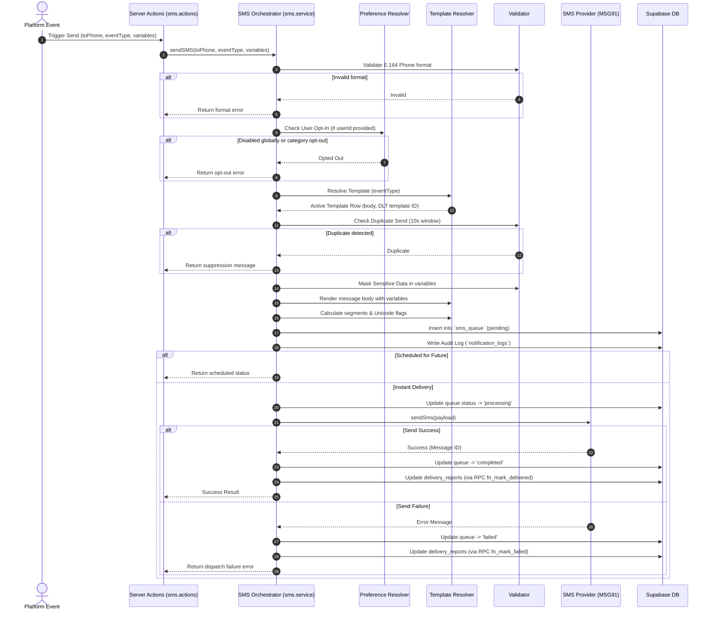

# Enterprise Transactional SMS Notification Module

This document explains the architecture, flow, queues, retries, analytics, security controls, and MSG91 provider integration for the Transactional SMS Notification module in **RishtaJodo Matrimony**.

---

## 1. Directory Structure

All components of the Transactional SMS Module are isolated inside `src/features/notification/sms/` to comply with Feature-First and Clean Architecture principles:

```
src/features/notification/sms/
├── actions/
│   └── sms.actions.ts           # Server Actions for send, schedule, retry, cancel, and status
├── config/
│   ├── sms.config.ts            # Default SMS settings (GSM-7/Unicode segment length limits)
│   ├── provider.config.ts       # MSG91 base URL, endpoints, authKey, default flow ID
│   ├── retry.config.ts          # Retry backoff delays (1m, 5m, 15m, 30m) and max attempts (5)
│   └── analytics.config.ts      # Volume limit alerts, default costs
├── interfaces/
│   └── sms-provider.interface.ts# Interface contract for SMS providers
├── providers/
│   ├── msg91-sms.provider.ts    # MSG91 SMS Provider using DLT Flow APIs
│   └── mock-sms.provider.ts     # Developer-friendly Console/Test Provider with failure simulation
├── services/
│   ├── sms.service.ts           # Core SMS Service (orchestration, validation, templating, logs)
│   ├── sms-queue.service.ts     # Batch job processor with worker locking
│   ├── sms-retry.service.ts     # Failed message retry scheduler & Dead-Letter Queue (DLQ) manager
│   ├── sms-analytics.service.ts # Aggregates logs into daily analytics rollups
│   ├── sms-template.resolver.ts # Loads, renders placeholders, and calculates segments
│   ├── sms-preference.resolver.ts# Checks user SMS toggles, category preferences, and quiet hours
│   └── sms-service.factory.ts   # Dependency Injection Factory (Live/Mock auto-wiring)
├── tests/
│   └── sms.test.ts              # Unit and integration test suite
├── types/
│   └── sms.types.ts             # SMS DTOs and provider types
└── validators/
    └── sms.validator.ts         # Validates E.164 phone, prevents duplicate sends, masks data
```

---

## 2. Architecture & Send Flow

The send workflow is fully decoupled and integrates with the existing notification tables:



---

## 3. Priority Queue & Worker Locking

SMS jobs are managed via the `sms_queue` table:
*   **Priorities**: SMS supports four priority levels: `'low'`, `'normal'`, `'high'`, and `'urgent'/'critical'`.
*   **Worker Engine (`SMSQueueService`)**: 
    *   Polls jobs matching `scheduled_for <= NOW()` and `status IN ('pending', 'scheduled')`.
    *   Applies a database lock by setting `status = 'processing'` and updating `updated_at`.
    *   Ensures that concurrent worker processes do not execute the same SMS.

---

## 4. Exponential Backoff Retry Policy & DLQ

When a provider dispatch fails or gets rejected:
1.  **Backoff Schedule**: The `SMSRetryService` schedules retries at specific intervals defined in `retry.config.ts`:
    *   Attempt 1: 1 minute delay
    *   Attempt 2: 5 minutes delay
    *   Attempt 3: 15 minutes delay
    *   Attempt 4: 30 minutes delay
    *   Attempt 5: 30 minutes delay
2.  **Dead-Letter Queue (DLQ)**: If a message fails after 5 retries, the job status is set to `'dead_lettered'`, and it is automatically moved to the `failed_notifications` table. This logs the final failure reason, original payload, and audit details for administrators to manually review and retry.

---

## 5. Security & Spam Controls

*   **Syntax Check**: Filters invalid numbers before any provider dispatch or database insert.
*   **Duplicate Suppression**: Rejects sending identical messages to the same phone number within a rolling 10-second window to prevent API looping or double clicks.
*   **Privacy Masking**: Automatically masks values for keys containing sensitive words (`otp`, `password`, `token`, `secret`, `cvv`, `pin`, `code`) in database requests and logs.
*   **Quiet Hours Check**: Respects user quiet hours (e.g. 22:00 to 08:00) by holding or rescheduling non-critical notifications, while allowing critical security alerts to bypass restrictions.

---

## 6. Analytics & rollups

*   Daily metrics are calculated from `notification_logs` using Supabase RPC `fn_upsert_daily_analytics`.
*   Rolls up total SMS sent, delivered, failed, average delivery times, and total cost based on segment counts (GSM-7 vs Unicode).
*   Enables admin dashboards to track provider performance and usage thresholds.
