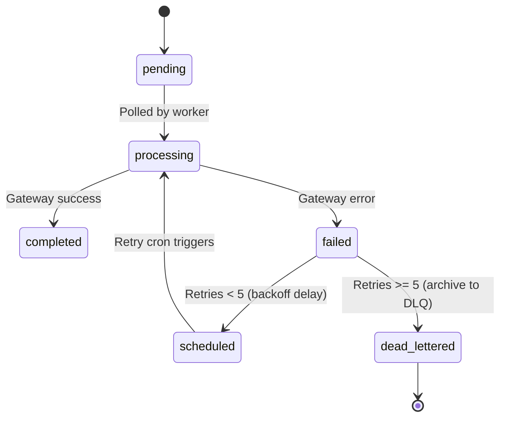

# WhatsApp Notification System Architecture

This document describes the technical architecture, database schemas, queues, and delivery tracking of the **WhatsApp Business API Infrastructure** in **RishtaJodo Matrimony**.

---

## 1. Technical Components & Dependencies

```
src/features/notification/whatsapp/
├── interfaces/
│   └── whatsapp-provider.interface.ts # Interface contract
├── providers/
│   ├── msg91-whatsapp.provider.ts    # MSG91 gateway transport
│   └── mock-whatsapp.provider.ts     # Dev sandbox & testing
├── services/
│   ├── whatsapp-renderer.ts          # Compiles positional JSON components
│   ├── whatsapp-template.resolver.ts # Loads schema parameters maps
│   ├── whatsapp-preference.resolver.ts# Opt-in and quiet hours checker
│   ├── whatsapp-queue.service.ts     # Worker locking queue processor
│   ├── whatsapp-retry.service.ts     # Backoff scheduler and DLQ router
│   ├── whatsapp-analytics.service.ts # Aggregates daily telemetry rollup
│   └── whatsapp-preview.service.ts   # Visual bubble previews mock
└── utils/
    └── whatsapp.logger.ts            # Audit logs and RPC mark statuses
```

---

## 2. Queueing & Locking Engine

WhatsApp queueing utilizes the `whatsapp_queue` database table:
1.  **Priority Dispatch**: WhatsApp queue selects jobs sorted by `priority` (`'low'`, `'normal'`, `'high'`, `'critical'`) and `scheduled_for`.
2.  **Worker Locks**: When `WhatsAppQueueService` polls, it updates jobs to `status = 'processing'` in a single batch, protecting against duplicate delivery in load-balanced environments.

---

## 3. Retries & Dead-Letter Queue (DLQ)



*   **DLQ Destination**: Exhausted jobs are archived in the `failed_notifications` table with status `'dead_lettered'`. This records the payload, final gateway error codes, and audit metrics.

---

## 4. Webhook Delivery tracking

*   **Webhook Listener**: Captures real-time webhook updates from MSG91 at `/api/notification/whatsapp/webhook` (delivered, read, failed) and maps them to database logs.
*   **Analytics Rollup**: Hourly/daily rollups compute messages sent, delivered, read rates, and cost using `fn_upsert_daily_analytics`.
